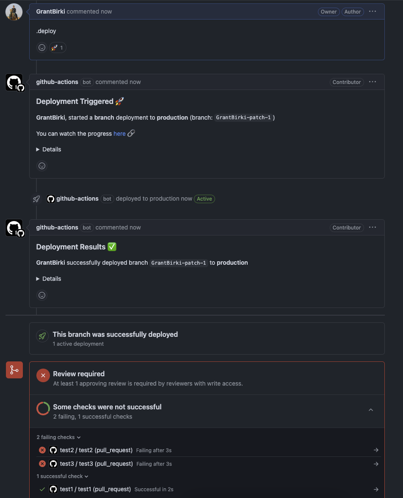
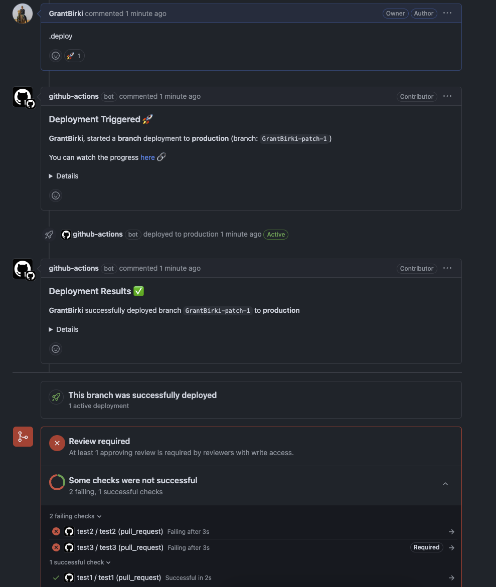

# Checks ✅

> This feature was originally requested via [#73](https://github.com/github/branch-deploy/issues/73) and further improved in [#321](https://github.com/github/branch-deploy/issues/321)

The branch-deploy Action contains a useful input option to help give developers more control over how CI checks are handled during the deployment process. Some teams may have very strict controls over deployments and require **all status checks** to pass before a deployment can start. In this case, all CI checks must pass and that includes required, or non-required checks. Other teams may have a more relaxed approach and only require certain checks to pass before a deployment can start. This is where the `checks` input option comes in handy.

## Required CI Checks

First, let's explain what a "required" CI check is in case you're not familiar. A required CI check is a check that must pass before a pull request can be merged. This is a setting that can be configured in the repository settings under the "Branches" section. This section is shown in the screenshot below:


> This example came directly from this respository's settings

So in this particular repository, the following CI checks are required:

- `test`
- `package-check`
- `lint`
- `actions-config-validation`

Any other CI checks that run on a pull request are not required and are considered non-required checks.

## Using the `checks` Input Option

This section will contain a few examples of how you can use the `checks` option

### Example 1: All CI Checks Must Pass

This example shows how you can use the `checks` option to require all CI checks to pass before a deployment can start. This is the **default** behavior of the Action if you do not specify the `checks` option.

```yaml
- name: branch-deploy
  uses: github/branch-deploy@vX.X.X # replace with the latest version of this Action
  id: branch-deploy
  with:
    checks: "all" # all CI checks (required or not) must pass before a deployment can start
```

### Example 2: Only Required CI Checks Must Pass

This example shows how you can use the `checks` option to require only the **required** CI checks to pass before a deployment can start. This is useful if you have non-required checks that you don't want to block a deployment.

```yaml
- name: branch-deploy
  uses: github/branch-deploy@vX.X.X # replace with the latest version of this Action
  id: branch-deploy
  with:
    checks: "required" # only required CI checks must pass before a deployment can start
```

The screenshot below demonstrates how this option works in a real-world scenario. You can see how there are two CI checks defined on the pull request. One is called `test1` which is **required** and **passing**. The other is called `test2` which is **not required** and **failing**. Since the `checks` option is set to `required`, the deployment will start because the required check is passing and is the only status check taken into consideration for a deployment.


### Example 3: Only specific CI checks must pass (required or not)

```yaml
- uses: github/branch-deploy@vX.X.X # replace with the latest version of this Action
  id: branch-deploy
  with:
    checks: 'test1' # we only care about the check named `test1`
```

> If you project has a lot of CI tests, no worries! You could do `test1,test2,<etc>` to specify multiple checks that must pass.



### Example 4: Only certain CI checks are ignored

```yaml
- uses: github/branch-deploy@vX.X.X # replace with the latest version of this Action
  id: branch-deploy
  with:
    ignored_checks: 'test2,test3' # these two checks are ignored and deployment will be allowed even if they are failing (and required)
```


